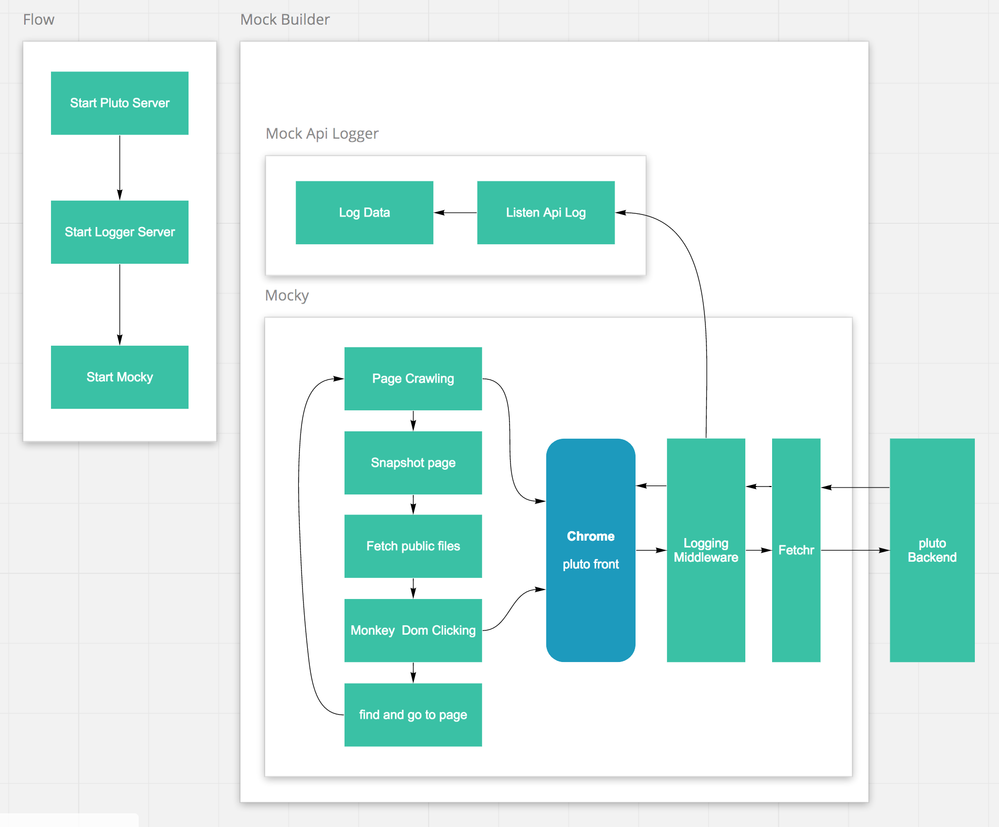

# Mock
## Proposal

自動でhtml|js|cssの静的ファイルを作成し、それらs3などでserveするだけで、モックページを確認をできる。

## How to
### build mock
```
$ npm run build:mock
```

### serve mock
```
$ npm run start:mock
```

## Configs
- mock/src/config.js
- src/server/configs/dev.js


## Architecture
### Mock Builder


### Mock Static Page
